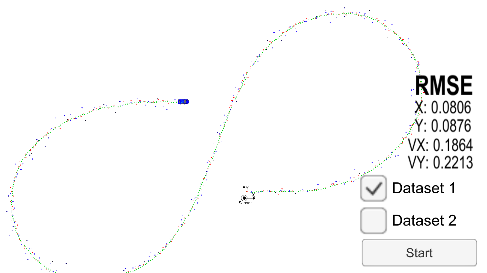

# Unscented-Kalman-Filters


I ran my algorithm using the two dataset, the result is depicted below:

### Dataset 1: 
```
Accuracy - RMSE:
x: 0.0805515
y: 0.087509
vx: 0.186273
vy: 0.221425
```



### Initialization of values 

Process noise / standard deviation for longitudinal acceleration:

```
I was looking for some research and stubmled upon this one, I chose Average Acceleration number	1.61 m/s^2
http://collisionanalysis.co.uk/down_files/cyclerates.htm.html
Using this number I chose a standard deviation of 0.8
```  

Process noise / standard deviation for yaw acceleration:
```
I experimented with a few values and settled using PI/8 rad/s^2
```

Speed:
```According to this page, the average cycling speed is 15.5 km/h, i.e. 4.3 m/s
https://en.wikipedia.org/wiki/Bicycle_performance
```

Covariance Matrix:
```I started with Identity matrix, but I was not getting good results, I switched to the one provided in the course material, this gives good results:

P_ << 0.0043, -0.0013, 0.0030, -0.0022, -0.0020,
        -0.0013, 0.0077, 0.0011, 0.0071, 0.0060,
        0.0030, 0.0011, 0.0054, 0.0007, 0.0008,
        -0.0022, 0.0071, 0.0007, 0.0098, 0.0100,
        -0.0020, 0.0060, 0.0008, 0.0100, 0.0123;
```        